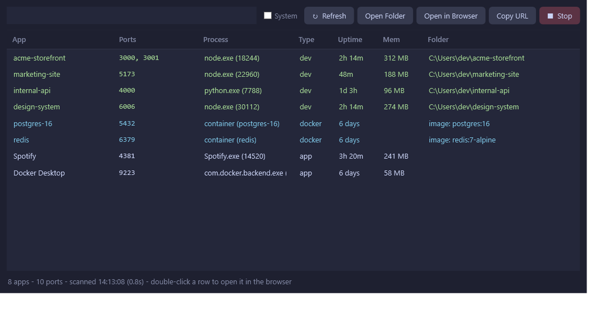

# Dev Ports

A single-file Windows tool that shows what's **listening on your local ports**, grouped by project, and lets you **stop it cleanly** — the whole process tree, not just the one PID.

If you run a lot of dev servers, you know the pain: something's holding port 3000, `netstat` gives you a bare PID, and killing it leaves orphaned `node` children behind. Dev Ports figures out which *project* a listener belongs to, shows it in a tidy grid, and stops the entire tree with one click.



## What it does

- **Groups listeners by project.** It walks each process's command line and parent chain to find the project folder (the directory above `node_modules`), so five ports from one `next dev` show up as one row, not five.
- **Detects Docker containers.** Ports published by containers are labelled with the container name and image (requires Docker Desktop running).
- **Classifies each row** as `dev`, `docker`, `app`, or `system`, and colour-codes them. System listeners are hidden by default (toggle with the **System** checkbox).
- **Shows uptime and memory** per app so you can spot the runaway process.
- **One-click actions:** open in browser (or double-click a row), copy the `localhost` URL(s), open the project folder, or **Stop** — which kills the full process tree via `taskkill /T`, or `docker stop` for containers.
- **Live filter** box across app name, port, process, and folder.
- **Auto-refreshes** when you switch back to the window.

## Requirements

- Windows 10/11 with PowerShell (Windows PowerShell 5.1 or PowerShell 7+).
- Docker Desktop is optional — container detection is skipped if it isn't running.
- No dependencies, no install, no admin required (though admin lets you stop processes owned by other users).

## Usage

```powershell
# Launch the GUI
powershell -ExecutionPolicy Bypass -File .\DevPorts.ps1

# Or a quick text scan in the terminal (no window), handy for scripting/CI
powershell -ExecutionPolicy Bypass -File .\DevPorts.ps1 -Smoke
```

You'll probably want a shortcut. Create one pointing at:

```
powershell.exe -ExecutionPolicy Bypass -WindowStyle Hidden -File "C:\path\to\DevPorts.ps1"
```

Pin that to your taskbar and you've got a one-click port dashboard.

## How the grouping works

For each listening TCP connection, Dev Ports:

1. Looks up the owning process and its command line.
2. Finds the project directory — the path segment before `\node_modules\`, or the first folder under your user profile that isn't `AppData`/an executable.
3. Walks *up* the parent process chain (up to 8 levels) while the parent is still part of the same project or is a known dev runner (`npm`, `pnpm`, `yarn`, `vite`, `next`, `turbo`, `nodemon`, `dotnet watch`, `uvicorn`, `flask`, …), stopping at shells, editors, and other "never kill" roots.

The result is the *root* process for a project, so stopping it takes the whole dev server down at once.

## Safety

- A confirmation dialog names the app, the process, and the ports before anything is killed.
- Windows kernel listeners (PID ≤ 4) and a curated "never kill" list (Explorer, terminals, VS Code, Cursor, Visual Studio, core Windows services) are protected from being walked up into or terminated.
- System-classified rows get an extra warning in the confirm dialog.

## Notes

- Colours are the [Catppuccin Macchiato](https://github.com/catppuccin/catppuccin) palette.
- Everything is in one `.ps1` file — read it, tweak it, no build step.

## License

MIT — do whatever you like with it.
